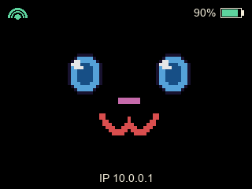
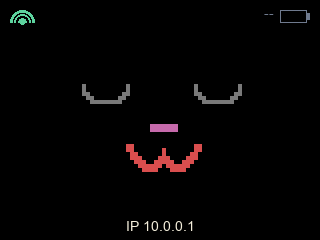

# Yahboom Dogzilla Lite Monitor

`yahboom-dogzilla-lite-monitor` is a small Python status-screen app for a
Raspberry Pi mounted on a Yahboom Dogzilla Lite setup. It renders a simple
on-device display showing:

- internet connectivity
- whether station telemetry is fresh
- the primary Dogzilla battery level when available
- WLAN IPv4 addresses reported by station system telemetry

## Examples

Station online, Wi-Fi connected, battery at 90%, IP `10.0.0.1`:



Station offline, Wi-Fi connected, battery unknown, IP `10.0.0.1`:



## Running

Generate protobuf Python code from the repository root before running against
real station telemetry:

```bash
make protobuf
```

Inspect the CLI locally:

```bash
cd software/station/examples/yahboom-dogzilla-lite-monitor
uv run --frozen yahboom-dogzilla-lite-monitor --help
```

Run on Raspberry Pi hardware with defaults:

```bash
uv run --frozen yahboom-dogzilla-lite-monitor
```

## Flags

| Flag | Default | Description |
| --- | --- | --- |
| `--poll-interval <seconds>` | `3.0` | Seconds between status refreshes. Non-positive values fall back to `3.0`. |
| `--station-tcp <address>` | `127.0.0.1:8888` | Station NormFS TCP endpoint used to read telemetry queues. If a port is omitted, `8888` is used. |
| `--dogzilla-queue <queue>` | `yahboom-dogzilla-lite/inference` | Station NormFS queue containing Yahboom Dogzilla Lite `InferenceState` payloads. |
| `--system-queue <queue>` | `system/rx` | Station NormFS queue containing `sysinfo.Envelope` payloads. |
| `--dogzilla-state-stale-after <seconds>` | `10.0` | Age after which Yahboom Dogzilla Lite telemetry is treated as stale. Non-positive values fall back to `10.0`. |
| `--system-state-stale-after <seconds>` | `10.0` | Age after which system telemetry is treated as stale. Non-positive values fall back to `10.0`. |

## What It Does

On each refresh cycle the monitor:

1. Keeps background station TCP clients connected to `--station-tcp`.
2. Reads the latest and then follows `--dogzilla-queue`, decoding each
   generated `yahboom_dogzilla_lite.InferenceState` payload for station presence
   and primary battery status.
3. Reads the latest and then follows `--system-queue`, decoding each
   `sysinfo.Envelope` payload published by `sysinfod`.
4. Treats Wi-Fi as connected when at least one `wlan*` interface has a valid
   non-loopback IPv4 address.
5. Draws the current state with Pillow and presents it to the configured screen.

If Yahboom Dogzilla Lite telemetry is missing, unreadable, or stale, the monitor
keeps running and shows the station as offline with no battery value. If system
telemetry is still fresh, Wi-Fi/IP can remain visible. If station TCP is not
ready yet, the monitor keeps retrying and updates the display when
`yahboom-dogzilla-lite/inference` and `system/rx` start delivering entries.

The ST7789 backend talks directly to Linux SPI and GPIO character devices.
Non-Linux hosts can inspect the CLI, but cannot render frames.
